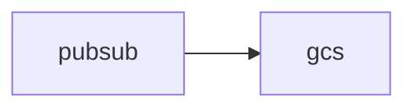

# 📊 Intelligent Multi-Agent FinOps & Cloud Architecture Intelligence System

## 🚀 Overview

This project is an AI-powered **multi-agent cloud intelligence platform** that converts plain-English architecture descriptions into:

- 📦 Structured cloud infrastructure components
- 🧠 Intent-aware architecture understanding
- ❓ Intelligent workload clarification
- ⚙️ Architecture expansion & enrichment
- 💰 FinOps cost estimation
- 📊 Architecture DAG + Mermaid diagrams
- ⚠️ Risk analysis & recommendations
- 📈 Optimization insights

---

## 🎯 Vision

> “Describe your cloud architecture in plain English → instantly receive architecture intelligence, cost estimation, diagrams, risks, and optimization recommendations.”

The system combines:

- ✅ Deterministic engineering rules
- ✅ LLM reasoning
- ✅ Validation pipelines
- ✅ FinOps intelligence
- ✅ Cloud architecture knowledge

This creates a production-grade hybrid AI system instead of relying purely on LLM hallucinations.

---

# 🧠 Problem Statement

Modern cloud systems are:

- Complex and distributed
- Poorly documented
- Expensive to estimate manually
- Difficult to optimize
- Hard to visualize
- Multi-cloud and rapidly evolving

Traditional FinOps workflows require:

- Senior cloud architects
- Deep pricing expertise
- Manual architecture reviews
- Complex spreadsheets
- Multiple engineering teams

This project automates a large part of that workflow.

---

# 🏗️ System Architecture

```text
User Input (Natural Language)
            ↓
🧠 Intent Agent
            ↓
🤖 Parser Agent
            ↓
🧹 Validation Layer
            ↓
❓ Clarifier Agent
            ↓
⚙️ Expander Agent
            ↓
💰 Cost Agent
            ↓
📊 Report + DAG Agent
            ↓
📈 Optimization Insights
```

---

# ⚙️ Multi-Agent Pipeline

## 1️⃣ Intent Agent

### Purpose
Understand the type of workload the user is describing.

### Responsibilities

- Detect architecture intent
- Identify workload characteristics
- Infer architecture patterns
- Detect real-time vs batch systems
- Extract workload signals

### Example Outputs

- Logging pipeline
- ETL system
- Streaming architecture
- Storage system
- API platform
- Analytics workload

### Features

- Hybrid rule + LLM system
- Cloud-provider awareness
- Confidence scoring
- Signal extraction
- Intent classification

---

## 2️⃣ Parser Agent

### Purpose
Convert unstructured English into structured cloud components.

### Example

Input:

```text
load logs into gcs and analyze using bigquery
```

Output:

```json
[
  {
    "name": "gcs",
    "type": "Object Storage",
    "provider": "gcp",
    "region": "global"
  },
  {
    "name": "bigquery",
    "type": "Data Warehouse",
    "provider": "gcp",
    "region": "global"
  }
]
```

### Features

- Rule-based extraction
- LLM fallback parsing
- Service normalization
- Region detection
- Multi-cloud ready
- Robust JSON extraction

---

## 3️⃣ Validation Layer

### Purpose
Prevent LLM hallucinations and schema corruption.

### Solves

- Invalid JSON
- Hallucinated services
- Wrong schemas
- Bad keys
- Missing values
- Duplicate services

### Example Fixes

```text
namener  → name
servicetp → type
```

### Features

- Schema normalization
- Strict ontology validation
- Duplicate removal
- Service allowlists
- Failure-safe fallbacks

---

## 4️⃣ Clarifier Agent

### Purpose
Ask only the most important questions required for cost estimation.

### Example Questions

- Daily data volume
- Retention period
- Streaming throughput
- Compute hours
- Monthly storage growth

### Features

- LLM-driven questioning
- Cost-aware prioritization
- Intent-aware clarification
- Retry handling
- Minimal questioning strategy
- Workload profile enrichment

### Goal
Avoid poor UX caused by excessive questioning.

---

## 5️⃣ Expander Agent

### Purpose
Infer missing infrastructure services only when truly required.

### Example

Input:

```text
stream logs into bigquery
```

Expanded Architecture:

```text
pubsub → dataflow → bigquery
```

### Features

- Intent-aware expansion
- Minimal infrastructure expansion
- Ontology-restricted services
- Deduplication
- Hallucination prevention
- Rule-based fallback logic

### Design Principle

> Expand only when architecture requires it.

Simple workloads should remain simple.

---

## 6️⃣ Cost Agent

### Purpose
Generate realistic cloud cost estimates.

### Supported Services

- Object Storage
- Streaming Queues
- Compute
- Data Warehouses
- Databases
- API layers

### Features

- LLM-assisted estimation
- Deterministic pricing baselines
- Conservative cost modeling
- Schema validation
- Breakdown generation
- Optimization recommendations
- Assumption tracking
- Failure-safe recovery

### Example Output

```json
{
  "total_cost": 20.0,
  "currency": "USD",
  "breakdown": [
    {
      "name": "gcs",
      "monthly_cost": 5.0
    },
    {
      "name": "pubsub",
      "monthly_cost": 15.0
    }
  ]
}
```

---

## 7️⃣ Report + DAG Agent

### Purpose
Convert raw architecture intelligence into executive-readable reports.

### Generates

- Executive summary
- Architecture summary
- Ordered DAG
- Mermaid diagram
- Cost breakdown
- Risk analysis
- Optimization recommendations

### Mermaid Example



### Features

- Intelligent component ordering
- Risk detection
- Architecture visualization
- FinOps reporting
- Recommendation generation

---

## 8️⃣ Optimization Engine (🚧 In Progress)

### Goal
Recommend architecture and cost improvements automatically.

### Planned Features

- Remove unnecessary services
- Suggest cheaper alternatives
- Batch vs streaming optimization
- Region optimization
- Lifecycle policy recommendations
- Spot/preemptible compute suggestions
- Query optimization
- Storage tier optimization

---

# 🧪 Example End-to-End Run

## User Input

```text
loads logs data into gcs
```

---

## Parsed Components

```json
[
  {
    "name": "gcs",
    "type": "Object Storage",
    "provider": "gcp",
    "region": "global"
  }
]
```

---

## Intent Analysis

```json
{
  "primary_intent": "Load logs data into GCS",
  "architecture_pattern": "Direct Storage Ingestion",
  "signals": {
    "batch": true,
    "cloud_provider": "gcp"
  },
  "confidence": 0.8
}
```

---

## Clarified Workload Profile

```json
{
  "data_size_per_day": "10 GB",
  "retention_days": "10 days",
  "monthly_storage": "100 GB"
}
```

---

## Final Cost Report

```json
{
  "total_cost": 5.0,
  "currency": "USD",
  "breakdown": [
    {
      "name": "gcs",
      "type": "Object Storage",
      "monthly_cost": 5.0,
      "reason": "Baseline cost for GCS object storage"
    }
  ],
  "optimizations": [
    "Enable lifecycle management to reduce storage cost"
  ]
}
```

---

# ⚠️ Key Engineering Challenges Solved

| Problem | Solution |
|---|---|
| LLM hallucinations | Validation layer |
| Invalid JSON | Safe extraction logic |
| Missing workload details | Clarifier agent |
| Over-questioning | Intent-aware prioritization |
| Bad architecture expansion | Ontology-based expander |
| Cost inconsistency | Deterministic baselines |
| Pipeline crashes | Failure-safe retries |
| Duplicate services | Deduplication engine |

---

# 🧠 Key Learnings

## ❌ Pure LLM Systems Fail Frequently

LLMs are not reliable structured parsers.

They:

- hallucinate services
- break JSON
- invent schemas
- over-engineer architectures

---

## ✅ Hybrid Systems Work Best

The best architecture combines:

- deterministic validation
- ontology enforcement
- rules
- retries
- LLM reasoning

---

## ❌ Asking Too Many Questions Hurts UX

Traditional systems ask everything.

This system asks only:

- cost-critical
- architecture-critical
- missing information

---

## ✅ Validation Layers Are Mandatory

Every LLM output must pass through:

- normalization
- schema validation
- ontology enforcement
- safety filtering

---

# 📊 Current System Status

| Component | Status |
|---|---|
| Intent Agent | ✅ Stable |
| Parser Agent | ✅ Stable |
| Validation Layer | ✅ Stable |
| Clarifier Agent | ⚠️ Improving |
| Expander Agent | ⚠️ Improving |
| Cost Agent | ✅ Stable |
| Report Agent | ✅ Stable |
| Optimization Engine | 🚧 In Progress |
| True DAG Builder | 🚧 Planned |
| Pricing API Integration | 🚧 Planned |

---

# 🔮 Future Roadmap

# Phase 2 — Intelligence Upgrade

### Planned

- 🧠 Dependency graph builder
- 📊 Real DAG generation
- 💡 Smart optimization engine
- 🌍 Real cloud pricing APIs
- 🧩 Pattern-based architecture engine
- 📈 Cost anomaly prediction

---

# Phase 3 — Enterprise Platform

### Planned

- 📄 PDF report generator
- 📊 Dashboard UI
- 🧠 Self-healing architecture advisor
- 📉 Cost heatmaps
- 🔍 Architecture drift detection
- 🧩 Visual architecture explorer
- ☁️ Multi-cloud intelligence

---

# 🧰 Tech Stack

| Layer | Technology |
|---|---|
| Language | Python 3.10+ |
| LLM Runtime | Ollama |
| Architecture | Multi-Agent System |
| Parsing | JSON + Regex |
| Validation | Deterministic Rules |
| Visualization | Mermaid DAG |
| Cost Engine | Hybrid LLM + Rules |

---

# 🏁 Project Evolution

This project evolved from:

```text
Simple Cost Calculator
        ↓
AI FinOps Advisor
        ↓
Cloud Architecture Intelligence System
        ↓
Autonomous Cloud Optimization Platform
```

---

# 👨‍💻 Use Cases

## Ideal For

- FinOps engineers
- Cloud architects
- DevOps teams
- Platform engineering teams
- AI infrastructure researchers
- Startup infrastructure planning
- Cloud migration analysis

---

# 📌 Design Philosophy

This system is designed to be:

- Modular
- Extensible
- Production-scalable
- Failure-safe
- Explainable
- Hybrid (LLM + deterministic)
- Architecture-aware
- FinOps-focused

---

# ⭐ Long-Term Vision

> “A fully autonomous cloud intelligence system capable of understanding, optimizing, visualizing, and continuously improving cloud architectures from natural language.”

Future capabilities:

- automatic optimization
- self-healing recommendations
- cloud migration planning
- architectural risk prediction
- infrastructure governance
- AI-assisted cloud design

---

# 🙌 Conclusion

This project demonstrates how modern AI systems should be built:

- not purely deterministic
- not purely LLM-based
- but intelligently hybrid.

It combines:

- cloud architecture reasoning
- FinOps intelligence
- validation systems
- LLM orchestration
- structured engineering design

to create a scalable cloud intelligence platform.

